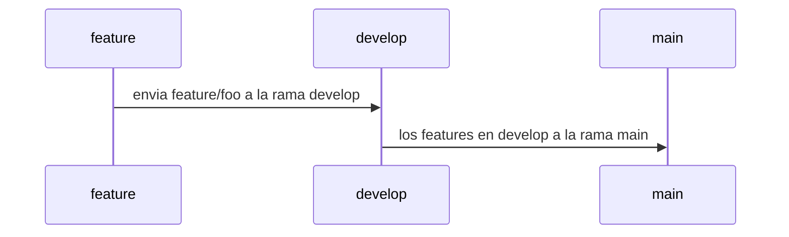

| Hacks | Details            |
| ----- | ------------------ |
| H-1   | Hacks              |
| H-2   | Close Pull Request |
| H-3   | Code Review        |

 

---

### WORKFLOW

---

PULL_REQUEST_TEMPLATE

# Tipo de usuario

- [ ] Alfa
- [ ] Bravo
- [ ] Charlie
- [ ] Delta
- [ ] Echo

# Tecnología

- [ ] HTML
- [ ] Json
- [ ] Archivo plano (.txt)
- [ ] Javascript
- [ ] Markdown / .md

# Seleccione el tipo de actividad

- [ ] Feature
- [ ] Changes
- [ ] Hotfix
- [ ] Refactor
- [ ] Performance
- [ ] Testing
